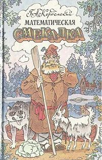

  
# Проект 0. Угадай число

## Оглавление
[1. Описание проекта](#Описание-проекта)  
[2. Какой кейс решаем?](#Какой-кейс-решаем)  
[3. Краткая информация о данных](#Краткая-информация-о-данных)  
[4. Этапы работы над проектом](#Этапы-работы-над-проектом)  
[5. Результат](#Результат)    
[6. Выводы](#Выводы) 

### Описание проекта    
Угадать загаданное компьютером число за минимальное число попыток.

[к оглавлению](#up)

### Какой кейс решаем?    
Нужно написать программу, которая угадывает число за минимальное число попыток

**Условия соревнования:**  
- Компьютер загадывает целое число от 0 до 100, и нам его нужно угадать. Под «угадать», подразумевается «написать программу, которая угадывает число».
- Алгоритм учитывает информацию о том, больше ли случайное число или меньше нужного нам.

**Метрика качества**     
Результаты оцениваются по среднему количеству попыток при 1000 повторений.
При работе над проектом, я немного изменил задание, приняв в качестве метрики не среднее (которое является всего лишь оценкой математического ожидания), а само математическое ожидание.

**Что практикуем**     
Учимся писать хороший код на python

### Краткая информация о данных
Для работы программа генерирует целое случайное число от 1 до 100
  
[к оглавлению](#up)

### Этапы работы над проектом  
**Алгоритм**

Подобные алгоритмы, основанные на принципе ___дихотомии___ хорошо известны: их можно найти в любой книге по занимательной математике.

Чтобы угадать число за наименьшее число попыток, надо последовательно делить интервал на равные части, до тех пор, пока он не уменьшится до одного числа, которое и будет искомым. Для того, чтобы узнать, в каком из двух интервалов находится число, надо сравнить его с границей этих интервалов. 

**Генерация случайного числа**

Для генерации целого случайного числа из интервала [1,100] воспользуемся функцией randint() случайного модуля Random библиотеки Numpy

    import numpy as np
    number = np.random.randint(1, 101)

**Переменные**

Для начала нам понадобятся следующие переменные:

    infimum=1
    supremum=100
    count=0

Переменные infimum и supremum задают соответственно нижнюю и верхнюю грани интервала, в котором находится число, count - количество попыток угадывания.

**Реализация алгоритма на Python**

    while True:
        count += 1
        predict_number = (infimum+supremum)//2
        if predict_number > number:
            print("Число должно быть меньше!")
            supremum=predict_number
        elif predict_number < number:
            print("Число должно быть больше!")
            infimum=predict_number
        else:
            print(f"Вы угадали число! Это число = {predict_number}, за {count} попыток")
            break # конец игры, выход из цикла

В этом блоке кода задействована переменная predict_number, которая хранит предполагаемые значения "неизвестного" числа для каждой попытки угадывания. Согласно алгоритму, эти значения лежат посередине интервала, определнного на предыдущем шаге и одновременно служат границей нового интервала, рассматриваемого на следующем шаге.
Так как угадываемое число - целое, а середина интервала может быть дробной, в выражении используется целочисленное деление.
По этой причине за верхнюю границу первого интервала взято число 101 а не 100, в противном случае, если будет "задумано" число 100, цикл не завершится.

Действительно:
* 1-й шаг (1+100)//2=50;
* 2-й шаг (50+100)//2=75;
* 3-й шаг (75+100)//2=87;
* 4-й шаг (87+100)//2=93;
* 5-й шаг (93+100)//2=96;
* 6-й шаг (96+100)//2=98;
* 7-й шаг (98+100)//2=99;
* 8-й шаг (99+100)//=99.

При всех последующих попытках получим число 99.

Вторая часть программы служит для оценки результата.
[(см. Описание проекта)](#Метрика-качества)  По тому же алгоритму программа считает количество попыток для каждого числа (цикл "while") в диапазоне i от
1 до 100 (цикл for), суммируя общее количество попыток (переменная schet). Так как все числа от 1 до 100 имеют равную вероятность быть "загаданными", математическое ожидание (M_COUNT) находится делением общего числа попыток на количество целых чисел от 1 до 100.

[к оглавлению](#up)

### Результаты:  
Программа "Угадай число" справляется с задачей угадывания числа не более, чем за 7 попыток при математическом ожидании 5,8 попыток.

[к оглавлению](#up)

### Выводы:  
Полученные результаты являются оптимальными. В самом деле, для кодирования 100 чисел нужно 7 бит информации, так как 2^7=128>100, а 2^6=64<100. Это равносильно семи ответам да/нет на вопрос "является загаданное число большим, чем предложенное".

[к оглавлению](#up)

Если информация по этому проекту покажется вам интересной или полезной, то я буду очень вам благодарен, если отметите репозиторий и профиль 5-ю баллами